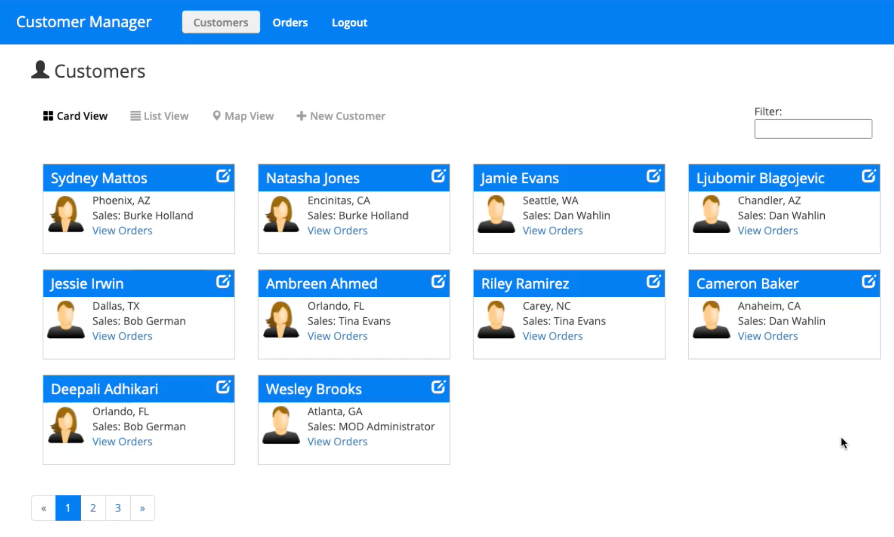
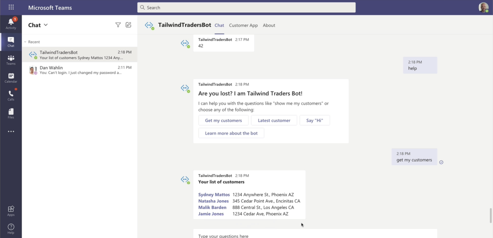
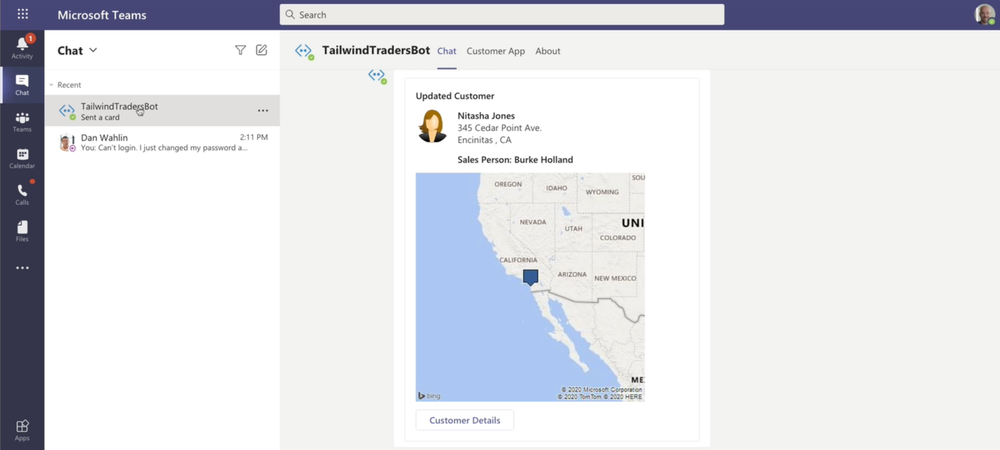
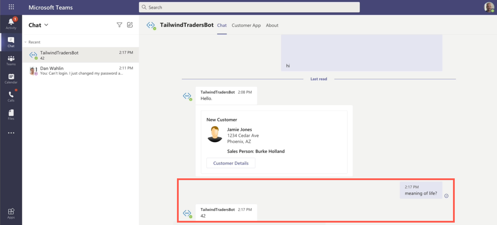

# Developing Apps for Teams

This sample application demonstrates how to integrate a Web application into Teams. The app is a Line of Business (LOB) application that can be accessed directly in the browser or from within Teams. 

Key features include:

- Users can login and access the app directly in the browser OR within Teams:

    

    

- Users can manage customers:
    - View customers (card view, grid view. and map view)
    - View customer details (including location information provided by [Bing maps](https://www.bing.com/api/maps/sdkrelease/mapcontrol/isdk/Overview?toWww=1&redig=8DF0B40854BC46A79984BFD86AD8A4F0&WT.mc_id=m365-11189-cxa#TS))
    - Edit customers
    - Page customers
    - Filter customers
- Users can view customer orders
- Once the custom Teams app is installed, the LOB app can be accessed using the desktop, web, and mobile versions of Teams
- App functionality can be accessed using a Bot within Teams:

    

- As customers are changed in the app, the Bot can notify users directly in Teams:

    

- The Bot can even be used to answer important questions such as the meaning of life (you can of course replace this "fun" functionality with custom requirements from your business domain):

    

From a technology standpoint, the application uses the following functionality:

- [Azure Active Directory](https://docs.microsoft.com/en-us/azure/active-directory/?WT.mc_id=m365-11189-cxa) and [Microsoft Authentication Library](https://docs.microsoft.com/en-us/azure/active-directory/develop/msal-overview/?WT.mc_id=m365-11189-cxa) (MSAL) when the app runs outside of Teams
- [Single Single-On](https://docs.microsoft.com/en-us/microsoftteams/platform/tabs/how-to/authentication/auth-aad-sso/?WT.mc_id=m365-11189-cxa) when the app runs inside of Teams
- The [Teams JavaScript client SDK](https://docs.microsoft.com/en-us/javascript/api/overview/msteams-client?view=msteams-client-js-latest/?WT.mc_id=m365-11189-cxa)
- Teams app [custom tab](https://docs.microsoft.com/en-us/microsoftteams/platform/tabs/what-are-tabs/?WT.mc_id=m365-11189-cxa)
- [Bot](https://docs.microsoft.com/en-us/microsoftteams/platform/bots/what-are-bots/?WT.mc_id=m365-11189-cxa) that leverages [LUIS and QnA Maker Azure Cognitive Services](https://docs.microsoft.com/en-us/azure/cognitive-services/what-are-cognitive-services/?WT.mc_id=m365-11189-cxa#language-apis)
- App to Bot communication
- [Angular](https://angular.io/?WT.mc_id=m365-11189-cxa) on the client-side and [Node](https://nodejs.org/?WT.mc_id=m365-11189-cxa) on the server-side.

**NOTE:** This application is a work in progress that will continue to be enhanced and updated over time. Consider forking this repository if you want to easily return to this version.

## Application Setup Instructions

To setup the application please follow the instructions in the [SETUP.md](SETUP.md) file.

## Contributing

This project welcomes contributions and suggestions.  Most contributions require you to agree to a
Contributor License Agreement (CLA) declaring that you have the right to, and actually do, grant us
the rights to use your contribution. For details, visit [https://cla.opensource.microsoft.com](https://cla.opensource.microsoft.com/?WT.mc_id=m365-11189-cxa).

When you submit a pull request, a CLA bot will automatically determine whether you need to provide
a CLA and decorate the PR appropriately (e.g., status check, comment). Simply follow the instructions
provided by the bot. You will only need to do this once across all repos using our CLA.

This project has adopted the [Microsoft Open Source Code of Conduct](https://opensource.microsoft.com/codeofconduct/?WT.mc_id=m365-11189-cxa).
For more information see the [Code of Conduct FAQ](https://opensource.microsoft.com/codeofconduct/faq/?WT.mc_id=m365-11189-cxa) or
contact [opencode@microsoft.com](mailto:opencode@microsoft.com) with any additional questions or comments.

## Trademarks

This project may contain trademarks or logos for projects, products, or services. Authorized use of Microsoft 
trademarks or logos is subject to and must follow 
[Microsoft's Trademark & Brand Guidelines](https://www.microsoft.com/en-us/legal/intellectualproperty/trademarks/usage/general/?WT.mc_id=m365-11189-cxa).
Use of Microsoft trademarks or logos in modified versions of this project must not cause confusion or imply Microsoft sponsorship.
Any use of third-party trademarks or logos are subject to those third-party's policies.
