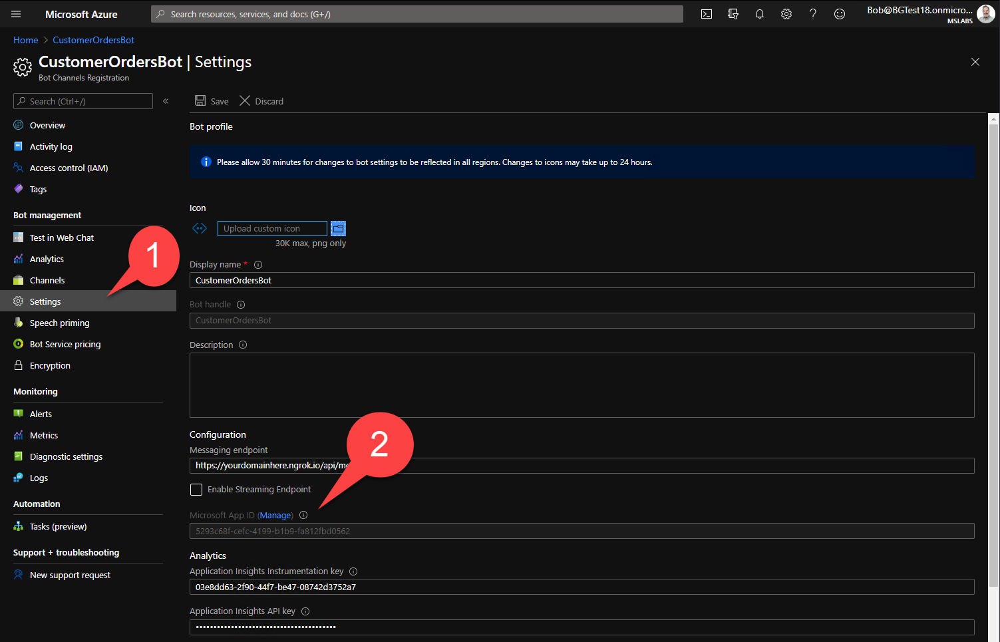

## Application Setup Instructions

To setup the application ensure that you have the following prerequisites installed and follow the `Setup Steps` section below.

## Prerequisites

To build and run the solution in a development environment, you will need:

- [Microsoft 365 tenant](https://developer.microsoft.com/microsoft-365/dev-program/?WT.mc_id=m365-11189-cxa)
- [Microsoft Azure](https://portal.azure.com/?WT.mc_id=m365-11189-cxa) subscription that is associated with the same Azure AD tenant as the M365 tenant (see section 1.2 below for details)
- [Node.js LTS](https://nodejs.org/?WT.mc_id=m365-11189-cxa)
- [Azure CLI](https://docs.microsoft.com/cli/azure/install-azure-cli/?WT.mc_id=m365-11189-cxa)
- [PowerShell](https://docs.microsoft.com/powershell/scripting/install/installing-powershell?view=powershell-7.1&WT.mc_id=m365-11189-cxa)
- [ngrok](https://www.ngrok.com/?WT.mc_id=m365-11189-cxa) or equivalent tunneling solution for testing the Bot

## Setup Steps

The following instructions will help you get the project running locally on your computer. If you want to deploy it to Azure, you will need to adjust the URL of where the web app is hosted to match the URL of your web app in Azure.

### 1. Set up the web application

First, we'll set up the Customer Orders App, which is a single-page application and associated web service that provides the application's tabs.
#### 1.1 Set up SSL and a host name

Start by creating a self-signed SSL certificate and custom host name that will resolve to your computer. In these instructions, we use the host name _devappsforteams.local_; if you choose something different, please substitute your name for that one in the steps that follow. Note that your host name must be a valid DNS name (FQDN).

**NOTE:** Although ngrok provides a way to run a local server using SSL and access it externally, we won't be using it here since 2 tunnels would be needed for this app (one for the app itself and one for the bot). As a result you would need a paid version of [ngrok](https://ngrok.com/?WT.mc_id=m365-11189-cxa). While we won't be using ngrok here to run the app (due to the paid requirement), if you do have a paid version of ngrok you can skip this section and use the URL of your ngrok tunnels instead.

##### 1.1.1 Create certificate authority and a certificate

1. Open terminal
1. Create a certificate authority by executing:

    ```sh
    npx mkcert create-ca --organization "MyOrg" --validity 825
    ```

1. Create a certificate by executing:

    ```sh
    npx mkcert create-cert --ca-key "ca.key" --ca-cert "ca.crt" --validity 825 --domains "devappsforteams.local"
    ```

    As the domain name, you can specify the DNS host name (FQDN) you chose to use throughout the project. In the next step, you will configure your computer to resolve this hostname to your local machine.

1. Follow the steps in [this article](https://bob1german.com/2020/10/17/setting-up-ssl-for-tabs-in-the-teams-toolkit-for-visual-studio-code/?WT.mc_id=m365-11189-cxa) to add the generated certificate authority to your cert store.

##### 1.1.2 Configure a host name for the tab and SSO web service

1. In a code editor (start as administrator), open your `hosts` file based on your target operating system:

    **Windows:** `c:\windows\system32\drivers\etc\hosts`

    **Mac:** `/etc/hosts`
    
    Append your FQDN as shown next: `127.0.0.1    devappsforteams.local`
    
    **IMPORTANT:** Make sure that you replace `devappsforteams.local` with the FQDN you chose in the previous steps.

1. Save your changes

##### 1.1.3 Configure certificate and host name with the web app

1. In the `CustomerOrdersApp` folder, create a new folder named `.cert`
1. Copy the generated `cert.crt` and `cert.key` files to a new folder `CustomerOrdersApp/.cert`
1. In the code editor, open the `CustomerOrdersApp/server.js` file and on this line, update the value of the `domain` const to match your FQDN if you chose something different.

~~~javascript
domain = 'devappsforteams.local';
~~~

#### 1.2 Deploy Azure AD configuration

1. Obtain your Microsoft 365 tenant ID. This indicates the Azure AD instance that is used by your Microsoft 365 tenant. To obtain the Microsoft 365 tenant ID, browse to [https://admin.microsoft.com](https://admin.microsoft.com/?WT.mc_id=m365-11189-cxa), log in with your development M365 account, and then browse to the Azure Active Directory option on the left. The Tenant ID on the overview page contains the tenant ID you need to use in your `az login` command.


> NOTE: If the Azure subscription you plan to use is associated with a different tenant ID, you will need to change it so both the Azure services and M365 are using the same Azure AD instance. Note that this change is likely to break other solutions already deployed in the Azure subscription, so if there are other solutions already in use, you'll want to obtain another Azure subscription and associate it with your M365 tenant. For detailed instructions, follow [this blog article](https://laurakokkarinen.com/how-to-use-the-complimentary-azure-credits-in-a-microsoft-365-developer-tenant-step-by-step/?WT.mc_id=m365-11189-cxa) from MVP [Laura Kokkarinen](https://twitter.com/laurakokkarinen/?WT.mc_id=m365-11189-cxa). 

1. In the code editor, open the `setup/setup.ps1` file
1. Change the value of the `$domain` variable to the FQDN you chose previously followed by `:8443`, eg. `devappsforteams.local:8443`
1. Start PowerShell
1. Change the working directory to `setup` (a folder located in this repository)
1. Login to Azure:

    ```powershell
    az login --tenant <REPLACE_WITH_TENANT_NAME_OR_ID> --allow-no-subscriptions
    ```

1. If this is the first time you've run a PowerShell script on this computer, run PowerShell as an administrator and enable script execution on your computer:

    ```powershell
    Set-ExecutionPolicy Unrestricted
    ```

1. Execute the setup script:

    ```powershell
    ./setup.ps1
    ```

    **Tip:**
    If the setup script fails with an `Request_ResourceNotFound` error, execute the script again. Sometimes creating the Azure AD app takes longer than expected and when the script continues, the app isn't fully provisioned yet. Running the script again will update the previously created app with the missing values.

1. Take note of the `AppId`, `AppPassword` and `AppUri` output by the setup script. Make sure that you save these values somewhere secure before continuing.

#### 1.3 Configure the web app

1. In the code editor open the `CustomerOrdersApp/.env sample` file
1. Change the value of the `AppId` and `AppPassword` properties to match the values returned by the setup script in the previous step
1. Save the file as `CustomerOrdersApp/.env`
1. Locate the `CustomerOrdersApp/src/environments/environment-sample.ts` and perform the following steps:

    - Make a copy of the file and paste it in the same `environments` folder. 
    - Rename the newly copied file to `environment.ts`.

1. Open `environment.ts` and perform the following steps:

    - Change the `appId` property value to the `AppId` value that you saved in the previous section when setting up Azure Active Directory.
    - Later in the Bot steps you will also update the `botApiUrl` property value.

1. Add yourself as a sales person by modifying CustomerOrdersApp/data/sales-people.json. Change the name of one of the sales people to your name - specifically your name exactly as it appears when you're using Teams in your development tenant. This will ensure you have some customers to test with when using the Bot portion of the solution.

#### 1.4 Start the web app

1. Open terminal
1. Change the working directory to `CustomerOrdersApp`
1. Restore project dependencies by executing:

    ```sh
    npm install
    ```

1. Build the web app by executing:

    ```sh
    npm run build
    ```

1. Start the web app by executing:

    ```sh
    npm start
    ```

1. Verify that you can open the web app, by navigating in the browser to `https://devappsforteams.local:8443`, where the domain name is the FQDN you chose previously

### 2. Set up the Bot

*Bots* allow users to interact with your application through conversational text, interactive cards, and task modules. *Messaging extensions* allow users to interact with your application service through buttons and forms in the Microsoft Teams client. They can search or initiate actions, and can interact with users when they compose a message, use the command box, or use the context menu directly from a chat message.

#### 2.1. Configure Cognitive Services

Two Azure Cognitive Services, LUIS (Language Understanding Intelligent Services) and QnA Maker, are used to enable the bot to respond to natural language requests from users.

##### 2.1.1 Set up LUIS model (Language Understanding Intelligent Service)

1. Go to the [LUIS Portal](https://www.luis.ai/?WT.mc_id=m365-11189-cxa) and select `Login / Sign up`. Sign in with the same account used in Part 1 that has administrative rights to your Microsoft Azure subscription.

2. Select the arrow on the right side of the `New app` button and choose `Import as JSON`.


[Import](https://cda.ms/1RB/?WT.mc_id=m365-11189-cxa) `'TailwindLuis.json'` file available under **services > CognitiveServices** folder. Give your model a name and click "Done" to import the model.


3. You will see a list of the _intents_ the Bot can respond to.Train your LUIS model by choosing `Train` on the top right. 


4. Test your LUIS model by choosing `Test` and try using the following uttarances as an example, "Hi", "Can you help?" and "Get me my customer list" to see the intent results. For these test cases, the most probable intents should be "Greeting", "Help", and "Customers" respectively.


5. Publish your LUIS model by selecting `Publish` 1️⃣. Select `Production slot` 2️⃣ and `Done` 3️⃣.


6. Go to **Manage** on the top right and then **Azure resources** tab. Select `Add prediction resource`.


If you have a prediction resource, you can choose it here. If not, click the `Create a new prediction resource` link on the bottom.


If you are creating a new prediction resource, fill the fields as the following and click `Done`:

    * **Azure subscription:** Choose your Azure subscription
    * **Azure resource group:** Choose a resource group
    * **Location:** Choose preferred location
    * **Price Tier:** Choose preferred price tier

7. Save the `Endpoint URL` 1️⃣ and `Primary Key` 2️⃣ somewhere for future use.


Then switch to the Setup tab 1️⃣ and save the `App ID` 2️⃣.


8. Open the project in your code editor. In the /teams folder, copy the `.env sample` file to a new file called `.env`. Add the following fields to your `/teams/.env` file:

    ```
    LuisAppId= <App-ID>
    LuisAPIKey= <Primary-Key>
    LuisAPIHostName=<Fully qualified domain name for hostname from Endpoint-URL>
    ```

#### 2.2 Set up QnA Maker

##### 2.2.1 Create QnA Maker Knowledge Base

Go to [QnA Maker Portal](https://www.qnamaker.ai/?WT.mc_id=m365-11189-cxa) and select `Sign in` from top right. Sign in with your Azure admin account.
Click on `Create a knowledge base` on the top 1️⃣ and complete the steps shown on the screen 2️⃣.


* **STEP 1**:If you already have a QnA service, you can skip this step. If you don't already have a QnA service, you'll need to create one now, click `Create a QnA Service`. You will be directed to [Azure Portal](https://portal.azure.com/?WT.mc_id=m365-11189-cxa) and login with the same account. Fill the fields as follows and select `Review + create`, then `Create`:

    * **Subscription:** Choose your Azure Subscription
    * **Resource group:** Choose a resource group or create new
    * **Name:** Give a name to your QnA service
    * **Price tier:** Choose pricing tier as *Standard*
    * **Azure Search location:** Choose preferred location
    * **Azure Search pricing tier:** Choose pricing tier as *Standard*
    * **App name:** Gıve a name to your app
    * **Website location:** Choose preffered location
    * **App insights:** Enable
    * **App insights location:** Choose preferred location
    
      Once your QnA service is created, return to [QnA Maker Portal](https://www.qnamaker.ai/?WT.mc_id=m365-11189-cxa) and continue with the steps.

* **STEP 2:** Select `Refresh` and choose the fields as following:
    * **Microsoft Azure Directory ID:** Choose your tenant
    * **Azure subscription name:** Choose your Azure subscription
    * **Azure QnA service:** Choose your QnA service you recently created
    * **Language:** English

* **STEP 3:** Give a name to your knowledge base

* **STEP 4:** Populate your knowledge base by selecting `+ Add file` link 1️⃣ and in the `services > CognitiveServices` folder 2️⃣ choose `TailwindQnAMaker.csv` 3️⃣ and click `Open` 4️⃣. Leave te **Chit-chat** radio buttons set to `None` 5️⃣ (the chit-chat messages are already built into the knowledge base you imported).


* **Step 5:** Select `Create your KB`.

##### 2.2.2 Train and publish your knowledge base

1. Select `Save and train` on the top right. 


1. Click on `Test` in the top navigation bar and test your knowledge base by asking questions as the following examples: "How old are you?", "Do you breathe?", "Can you dream?".

5. Go to **PUBLISH** in the top navigation bar and select `Publish` to publish your knowledge base.
##### 2.2.3 Copy QnA Maker info to .env file

6. Under the **Postman** tab, copy your `KnowledgeBase-ID` from /knowledgebases/`xxxx-xxxxx-xxxx`/generateAnswer 1️⃣; also copy `Host` 2️⃣ and `Authorization: EndpointKey` 3️⃣. 


Add the values to the `\teams\.env` file:

    ```
    QnAKnowledgebaseId= <KnowledgeBase-ID>
    QnAEndpointKey= <Authorization: EndpointKey>
    QnAEndpointUrl= <Endpoint URL>
    ```
 
#### 2.3 Configure Ngrok

Your app will run from a localhost server. You will need to setup Ngrok in order to tunnel from the Teams client to localhost. 

##### 2.3.1 Install Ngrok
Go to [Ngrok website](https://www.ngrok.com/?WT.mc_id=m365-11189-cxa) and install ngrok.

##### 2.3.2 Run Ngrok

1. Unzip and open ngrok, then run the following script:

    `ngrok http -host-header=rewrite 3978`

2. Copy your ngrok URL `https://{subdomain}.ngrok.io`; you will need it in the next step. Make sure you copy the https and not the http URL.

3. The CustomerOrdersApp calls a web service in the bot to ask it to notify users of changes. To allow this to work, return to the CustomerOrdersApp/src/environments/environment.ts and change the `botApiUrl` property value to the ngrok URL of your bot (without a `/api/messages` or even a trailing `/`). Don't forget to rebuild and restart the Customer Orders App

~~~bash
npm run build
npm run start
~~~

#### 2.3. Create Azure Bot Channels Registration

1. Go to [Azure Portal](https://portal.azure.com/?WT.mc_id=m365-11189-cxa) and select `+ Create a resource`. Search for `Bot Channels Registration` and choose `Create`. Fill the fields as follows and select `Create`:

    * **Bot handle:** Give a unique name to your bot (it must be unique across all of Microsoft Azure, so you may need to try a few options to find an available name)
    * **Subscription:** Choose your subscription
    * **Resource group:** Choose a resource group or create new
    * **Location:** Choose preferred location
    * **Pricing tier:** Choose preferred pricing tier; the free (F0) tier is fine for development
    * **Messaging endpoint:** For the Messaging endpoint URL, use the current `https` URL you were given by running ngrok and append it with the path `/api/messages`. It should like something work `https://{subdomain}.ngrok.io/api/messages`.
    * **Application Insights:** On
    * **Application Insights Location:** Choose preferred location
    * **Microsoft App ID and password:** Auto create App ID and password

Click Create to create the Bot channel registration.


2. Go to your **Bot Channels Registration** resource and select `Channels` from left-hand side menu 1️⃣. Choose `Microsoft Teams` icon to enable Teams as a channel 2️⃣. Agree to the terms of service and `Save`.


3. Go to **Settings** from left-hand side menu 1️⃣ and find `Microsoft App ID` and click on `Manage` link 2️⃣.



Clicking this link will bring you out of the Bot Channel Registration resource and into Azure AD, where you are now editing the Azure AD app registration that's used by the bot. The Azure Bot Channel you just created will use this application to authenticate itself to your bot. The App ID of this application is often referred to as the Bot ID; they are one and the same.

You will land in the **Certificates & secrets** section of this app registration.

4. In **Certificates & secrets**, select `+ New client secret` 1️⃣ and `Add`. Copy your new `Client Secret Value` 2️⃣.

> NOTE: You won't be able to copy or view the client secret once you leave this screen, but you can always creae a new one.


5. Go to **Overview** 1️⃣, and copy `Application (Client) ID` 2️⃣. 


6. Add the following fields in `.env` file:

    ```
    BotId= <Application-(Client)-ID>
    BotPassword= <Client-Secret-Value>
    ```

#### 2.4. Build and run your bot

Open your terminal in Visual Studio Code (`Ctrl+ Shift + '`) and type the following scripts in sequence:

1. Go to your Teams bot project folder:
    #### `cd Teams`

2. Install npm:
    #### `npm install`

3. Start your project:
    #### `npm start`

Now, your project is running on https://localhost:3978 which you've been tunneling with ngrok. To fully test the bot, ensure your Customer Orders App is still running as well (you'll need two terminal windows, plus one for ngrok).

### 2.5. Test your project on Microsoft Teams

1. Go to [Microsoft Teams](https://teams.microsoft.com/?WT.mc_id=m365-11189-cxa) and login with your [M365 developer account](https://docs.microsoft.com/microsoftteams/platform/concepts/build-and-test/prepare-your-o365-tenant/?WT.mc_id=m365-11189-cxa).

1. Within Teams, click "Chat" in the left sidebar 1️⃣, then click the New Message button 2️⃣. Paste the Bot ID (Bot's App ID obtained in section 2.3) into the To: box 3️⃣. Teams should find the bot name and show it in a pop-up 4️⃣; click the popup to begin conversing with the Bot. Type a test message into the compose area 5️⃣ and click Send.


1. Try saying some of these things to your new Bot:

      "Hello",

      "Get me my customer list",

      "Gimme customers",
      
      "Who is the latest customer",
      
      "Help",

      "Can you breathe",

      "How old are you",

      ...

If you need any reference for Teams app manifest, you may review **manifest sample.json** under the **Teams** project folder.


### 3. Build and deploy the Teams app
#### 3.1 Update Teams app manifest

1. Make a copy of the `Manifest/manifest sample.json` file and name it `manifest.json`. Ensure that you add `manifest.json` to the `Teams` folder.
1. Open `manifest.json` in a code editor.
1. In the `developer` property, change the value of the `websiteUrl`, `privacyUrl` and `termsOfUseUrl` properties to match the URL of your web app, eg. `https://devappsforteams.local:8443`
1. In the `configurableTabs` property, update the value of the `configurationUrl` property to match your ngrok tunnel followed by `config`, eg. `https://devappsforteams.local:8443/config`
1. In the `staticTabs` property, update the value of the `contentUrl` and `websiteUrl` properties to match the URL of your ngrok tunnel followed by `tab`, eg. `https://devappsforteams.local:8443/tab`
1. In the `bots` property, update the value of the `botId` property to the ID of the bot you configured in the previous step, eg. `ee3cda2a-4e28-495b-bc89-54f3a1a9f66e`
1. In the `validDomains` array, include your FQDN without the port number, eg. `devappsforteams.local`
1. In the `webApplicationInfo` property, update the value of the `id` property to the `AppId` value returned by the setup script
1. In the `webApplicationInfo` property, update the value of the `resource` property to the `AppUri` value returned by the setup script

### Create Teams app package

1. Open terminal
1. Change the working directory to `Teams`
1. Restore project dependencies by executing:

    ```sh
    npm install
    ```

1. Create Teams app package by executing:

    ```sh
    npm run build:zip
    ```

### Deploy app to Teams

1. In the web browser navigate to `https://teams.microsoft.com` and sign in with your dev account
1. From the left rail, select **Apps**
1. From the menu, select **Upload a custom app** and in the submenu choose `Upload for <your-organization>`
1. In the file dialog, select the generated `Teams/package/TailwindTraders.zip` file
1. In the list of apps, select the newly added app and in the app's dialog, choose **Add**
1. After the app launched, from the tab-header bar choose **Customer App**. You should see the web app launched inside Teams

TBD: add steps for trying out the bot